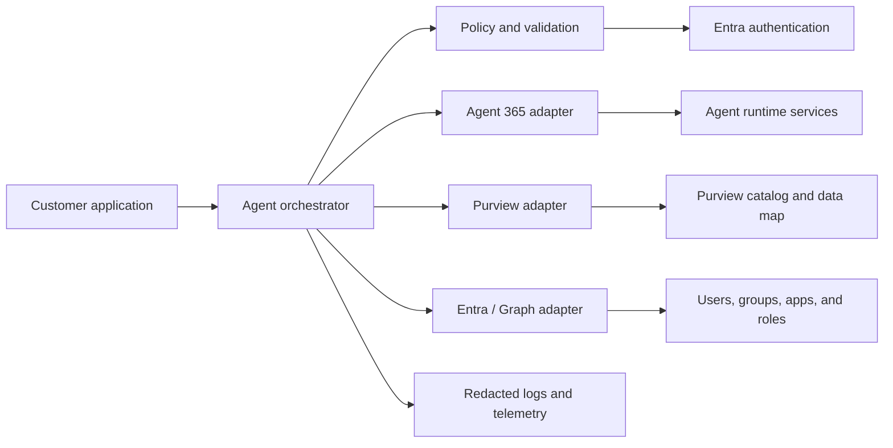

# Secure Agent Template — Customer Guide

A customer-ready reference for building secure enterprise agents with:

- **Microsoft Agent 365 SDK (A365)** for agent runtime capabilities, observability, notifications, and tooling.
- **Microsoft Purview** for catalog, governance, classification, lineage, and data discovery scenarios.
- **Microsoft Entra and Microsoft Graph** for authentication, users, groups, applications, service principals, roles, and permissions.

> **Preview notice:** Microsoft Agent 365 features and package names may change while they are in preview. Pin package versions, test upgrades in a non-production environment, and use the repository's SDK update workflow to review changes through pull requests.

## What this template provides

- A modular adapter pattern for A365, Purview, and Entra.
- Centralized Entra token acquisition.
- Environment-based configuration with no hard-coded credentials.
- Structured logging, correlation IDs, retry guidance, and secret redaction.
- Script-friendly field references for configuration and data retrieval.
- Scheduled SDK/version checks with PR-based updates.

## Architecture



## Quick start

1. Clone the repository.

   ```bash
   git clone https://github.com/mward-msft1/secureagenttemplate.git
   cd secureagenttemplate
   ```

2. Copy the environment template when it is available.

   ```bash
   cp .env.example .env
   ```

3. Register an application in Microsoft Entra ID or configure a managed identity.
4. Grant only the API permissions required by the operations your agent performs.
5. Configure the tenant, client, endpoint, and scope values.
6. Install dependencies and run the commands defined by the selected runtime implementation.

> This repository is a framework. Runtime-specific commands should be finalized when the implementation language is selected.

## Fast field reference

The full script-oriented reference is in [`docs/field-reference.md`](docs/field-reference.md). It includes:

- configuration and secret names;
- Purview search request fields and entity response fields;
- Entra/Microsoft Graph `$select`, `$filter`, `$expand`, paging, and delta options;
- common user, group, application, service principal, and role-assignment fields;
- Agent 365 context, notification, observability, and runtime fields;
- normalized output fields recommended for customer scripts.

## Minimum configuration

```dotenv
# Runtime
AGENT_NAME=secure-agent
AGENT_ENV=development
LOG_LEVEL=info
LOG_FORMAT=json
REQUEST_TIMEOUT_MS=30000

# Entra authentication
ENTRA_TENANT_ID=
ENTRA_CLIENT_ID=
ENTRA_CLIENT_SECRET=
ENTRA_AUTHORITY_HOST=https://login.microsoftonline.com
GRAPH_BASE_URL=https://graph.microsoft.com/v1.0
GRAPH_SCOPES=https://graph.microsoft.com/.default

# Purview
PURVIEW_ENABLED=true
PURVIEW_ENDPOINT=
PURVIEW_API_VERSION=2023-09-01
PURVIEW_SCOPES=https://purview.azure.net/.default

# Agent 365
A365_ENABLED=true
A365_SDK_LANGUAGE=dotnet
A365_SDK_PACKAGE_PREFIX=Microsoft.Agents.A365
A365_SDK_SOURCE=

# Security
SECURITY_REDACT_PII=true
SECURITY_REDACT_TOKENS=true
SECURITY_BLOCK_UNSCOPED_CALLS=true
```

Use a certificate, workload identity, or managed identity instead of a client secret for production deployments whenever supported.

## Choosing fields in scripts

Avoid returning an entire object when only a few properties are needed.

### Entra/Microsoft Graph example

```http
GET https://graph.microsoft.com/v1.0/users?$select=id,displayName,userPrincipalName,mail,accountEnabled,jobTitle,department
```

Add query options only as required:

- `$select` — properties to return;
- `$filter` — server-side filtering;
- `$search` — directory search; some operations require `ConsistencyLevel: eventual`;
- `$orderby` — sorting;
- `$top` — page size;
- `$expand` — related resources;
- `$count=true` — count results;
- delta endpoints — incremental synchronization.

### Purview search example

```json
{
  "keywords": "customer",
  "filter": {
    "and": [
      { "objectType": "Tables" },
      { "classification": "MICROSOFT.PERSONAL.NAME" }
    ]
  },
  "limit": 100,
  "orderby": [
    { "updateTime": "DESC" }
  ],
  "facets": [
    { "facet": "assetType", "count": 20 },
    { "facet": "classification", "count": 20 }
  ]
}
```

Purview entity attributes vary by asset type. Scripts should always handle missing attributes and preserve `typeName`, `guid`, and `qualifiedName` when available.

### Normalized output example

Use a stable internal shape so SDK changes do not propagate throughout customer code:

```json
{
  "source": "entra",
  "resourceType": "user",
  "id": "00000000-0000-0000-0000-000000000000",
  "name": "Example User",
  "qualifiedName": "example.user@contoso.com",
  "status": "active",
  "owners": [],
  "classifications": [],
  "labels": [],
  "raw": {}
}
```

Set `raw` only when troubleshooting or when an unmapped SDK property is required. Do not log it by default because it can contain personal or sensitive data.

## Authentication model

1. The script determines the requested operation.
2. The scope resolver maps the operation to the minimum required resource scope.
3. Entra issues an access token using managed identity, workload identity, a certificate, or a development secret.
4. The adapter calls A365, Purview, or Microsoft Graph.
5. The response is mapped to a stable internal model and sensitive fields are redacted from logs.

Do not use one broad permission set for every adapter. Keep Graph, Purview, and Agent 365 permissions separate and document why each permission is required.

## SDK auto-update workflow

The intended `.github/workflows/sdk-watch.yml` workflow should run daily and on demand. It should:

1. read `sdk-versions.json`;
2. query configured authoritative documentation, release feeds, and package registries;
3. compare the latest version with the tracked version;
4. update `sdk-versions.json` and `docs/sdk-updates.md`;
5. create or refresh a pull request for review.

Recommended workflow permissions:

```yaml
permissions:
  contents: write
  pull-requests: write
```

Do not auto-merge SDK updates without build, test, security, and compatibility validation.

## Security checklist

- [ ] No real credentials are committed.
- [ ] Production uses managed identity, workload identity, or certificates where possible.
- [ ] Permissions are least-privilege and tenant-admin consent is documented.
- [ ] Tokens, secrets, authorization headers, and raw personal data are redacted.
- [ ] Outbound endpoints are allowlisted.
- [ ] Timeouts, bounded retries, and rate-limit handling are enabled.
- [ ] Customer and tenant identifiers are not written to public logs.
- [ ] SDK updates are reviewed in pull requests before deployment.
- [ ] Preview SDKs are pinned to tested versions.

## Customer customization checklist

- [ ] Select the implementation language and replace placeholder commands.
- [ ] Identify the exact Agent 365 packages used by the solution.
- [ ] List required Purview asset types, classifications, and collections.
- [ ] Select only the Entra/Graph resource properties needed by the use case.
- [ ] Add operation-to-permission mappings.
- [ ] Add organization-specific retention and data-handling rules.
- [ ] Add unit tests for field mapping and response redaction.
- [ ] Add integration tests against a non-production tenant.

## Official references

- Microsoft Agent 365 SDK for .NET: https://learn.microsoft.com/en-us/dotnet/api/agent365-sdk-dotnet/agent365-overview
- Microsoft 365 Agents SDK: https://learn.microsoft.com/en-us/microsoft-365/agents-sdk/
- Microsoft Purview Data Map REST API: https://learn.microsoft.com/en-us/rest/api/purview/
- Microsoft Graph API: https://learn.microsoft.com/en-us/graph/api/overview
- Microsoft Graph user resource: https://learn.microsoft.com/en-us/graph/api/resources/user
- Microsoft Graph service principal resource: https://learn.microsoft.com/en-us/graph/api/resources/serviceprincipal

## Troubleshooting

### Authentication returns 401

- Confirm the authority, tenant, token audience, and scope.
- Confirm the credential has not expired.
- Ensure the script is using the token for the intended service.

### API returns 403

- Check application versus delegated permission requirements.
- Confirm admin consent and required Entra roles.
- Verify Purview collection/data-plane role assignments.

### A field is missing

- For Graph, add the property to `$select`; many properties are not returned by default.
- For Purview, verify the asset `typeName`; attributes vary by entity type.
- Check whether the field requires an additional permission, relationship expansion, beta endpoint, or preview SDK.
- Treat absent and `null` values safely.

### Results are incomplete

- Follow `@odata.nextLink` for Graph paging.
- Follow Purview `continuationToken` values.
- Use delta queries for incremental Graph synchronization when supported.

## License

This repository is licensed under the MIT License. Customer deployments remain responsible for their own security, compliance, licensing, and preview-feature review.
