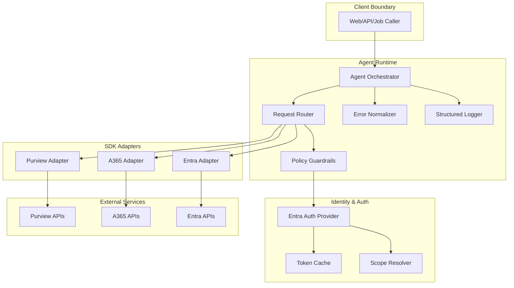

# Secure Agent Template (Internal Engineering)

This repository is the canonical engineering starter for secure enterprise AI agents integrating:

- **Microsoft Purview SDK**
- **A365 SDK**
- **Microsoft Entra SDK**

It is intended for reusable customer delivery patterns with strong defaults around identity, governance, and operational safety.

---

## Engineering objectives

1. **Composable adapter architecture** for Purview/A365/Entra integrations.
2. **Secure-by-default auth and config** (no embedded secrets, principle of least privilege).
3. **Operational readiness** (structured logs, deterministic error handling, CI automation).
4. **SDK drift management** (automated update checks + PR-based update flow).
5. **Customer handoff quality** (clear extension points and override mechanics).

---

## System architecture



### Design principles

- **Ports and adapters**: Orchestrator depends on interfaces, not SDK implementations.
- **Auth as a service**: Token acquisition centralized; adapters consume typed credentials.
- **Fault isolation**: Adapter failures normalized into common domain errors.
- **Observability first**: Every external call emits correlation-friendly structured events.

---

## Proposed repository layout

```text
.
├── .github/
│   └── workflows/
│       └── sdk-watch.yml
├── docs/
│   ├── integrations/
│   │   ├── purview.md
│   │   ├── a365.md
│   │   └── entra.md
│   ├── architecture.md
│   ├── threat-model.md
│   └── sdk-updates.md
├── src/
│   ├── agent/
│   │   ├── orchestrator.*
│   │   ├── router.*
│   │   ├── policies.*
│   │   └── errors.*
│   ├── adapters/
│   │   ├── purview/
│   │   │   ├── client.*
│   │   │   ├── mapper.*
│   │   │   └── index.*
│   │   ├── a365/
│   │   │   ├── client.*
│   │   │   ├── mapper.*
│   │   │   └── index.*
│   │   └── entra/
│   │       ├── client.*
│   │       ├── mapper.*
│   │       └── index.*
│   ├── auth/
│   │   ├── entra-provider.*
│   │   ├── scopes.*
│   │   └── token-cache.*
│   ├── config/
│   │   ├── env.*
│   │   ├── schema.*
│   │   └── index.*
│   ├── logging/
│   │   ├── logger.*
│   │   └── redaction.*
│   └── main.*
├── scripts/
│   ├── check-sdk-updates.*
│   └── generate-sdk-report.*
├── tests/
│   ├── unit/
│   └── integration/
├── .env.example
├── sdk-versions.json
└── README.md
```

> `*` denotes language-specific extension (.ts/.py/.cs) based on final runtime selection.

---

## Runtime baseline

If this repository is empty/new, recommended default:
- **TypeScript + Node LTS**
- Rationale:
  - Strong SDK ecosystem interoperability,
  - fast iteration for customer demos and references,
  - easy GitHub Actions integration for scheduled maintenance tasks.

If the repo already has a runtime, align with existing language/toolchain.

---

## Configuration contract

All config is environment-driven and schema validated at startup.

### Required environment variable groups

- **Core runtime**
  - `NODE_ENV` / equivalent
  - `LOG_LEVEL`
  - `APP_PORT` (if service-hosted)

- **Entra auth**
  - `ENTRA_TENANT_ID`
  - `ENTRA_CLIENT_ID`
  - `ENTRA_CLIENT_SECRET` (or certificate references)
  - `ENTRA_AUTHORITY_HOST`
  - `ENTRA_DEFAULT_SCOPES`

- **Purview**
  - `PURVIEW_ACCOUNT_NAME` or endpoint
  - `PURVIEW_API_VERSION`
  - `PURVIEW_SCOPES`

- **A365**
  - `A365_BASE_URL`
  - `A365_API_VERSION`
  - `A365_SCOPES`
  - `A365_SDK_SOURCE` (for update tracking)

### Validation expectations

Startup must fail-fast when:
- required values are missing,
- tenant/client settings are malformed,
- conflicting auth modes are configured.

---

## Auth/authz model

### Token flow

1. Orchestrator determines required downstream scopes from request intent.
2. Entra provider acquires token (client credentials or delegated mode).
3. Token is cached with safety margin before expiry.
4. Adapter receives token + correlation metadata for outbound call.

### Least-privilege guardrails

- Separate scopes per adapter and operation.
- Default deny for undefined operation-to-scope mappings.
- Optional policy layer to block risky actions without explicit enablement.

---

## Adapter contract (engineering)

Each SDK adapter should implement a consistent contract:

- `canHandle(operation: string): boolean`
- `execute(context, operation, payload): Promise<Result>`
- typed `ErrorMapping` from SDK/network errors → domain errors
- request/response mapper layer to decouple raw SDK types from agent domain models

This keeps the orchestrator stable as SDKs evolve.

---

## Error handling strategy

Normalize all failures into a shared taxonomy:

- `AuthError`
- `PermissionError`
- `ValidationError`
- `ExternalServiceError`
- `TransientDependencyError`
- `RateLimitError`
- `UnknownIntegrationError`

Each error includes:
- `correlationId`
- `adapter`
- `operation`
- retryability hint
- sanitized details (no tokens/secrets)

---

## Observability and logging

### Must-have fields per log event

- `timestamp`
- `level`
- `correlationId`
- `requestId` (if available)
- `adapter`
- `operation`
- `durationMs`
- `outcome` (`success|failure`)
- `errorCode` (if failure)

### Redaction policy

Never log:
- bearer tokens
- client secrets/private keys
- raw PII payloads

Prefer:
- identifiers hashed/truncated
- allowlist-based logging over denylist-based logging

---

## Local developer workflow

```bash
# 1) install dependencies
<package-manager-install>

# 2) bootstrap env
cp .env.example .env
# populate required values

# 3) run validation (optional but recommended)
<run-config-validate>

# 4) start app/service
<run-dev>

# 5) run tests and lint
<run-test>
<run-lint>
```

Replace placeholders with concrete commands in your runtime (npm/pnpm/pip/dotnet).

---

## CI/CD expectations

At minimum, CI should run:

1. dependency install
2. lint
3. unit tests
4. integration tests (where credentials/service mocks are available)
5. config schema validation (non-secret checks)
6. optional security scan (SAST/dependency checks)

---

## SDK update automation (required)

This template includes an automated watcher to keep SDK metadata current.

### Workflow: `.github/workflows/sdk-watch.yml`

Trigger modes:
- `schedule` (daily)
- `workflow_dispatch`

Pipeline behavior:
1. Read `sdk-versions.json`.
2. Query authoritative sources for Purview/A365/Entra SDK releases/docs.
3. Compare latest discovered version/date with tracked state.
4. On change:
   - update `sdk-versions.json`,
   - append summary entry to `docs/sdk-updates.md`,
   - create/update PR with a deterministic branch name (e.g. `chore/sdk-refresh-YYYYMMDD`).

### Workflow permissions

Minimum recommended:

```yaml
permissions:
  contents: write
  pull-requests: write
```

### Failure handling

- Retry transient network failures.
- Emit clear diagnostics in Action logs.
- Fail the run when source parsing breaks (so drift is visible).
- Keep source URLs configurable in `sdk-versions.json`.

---

## `sdk-versions.json` contract

Suggested schema:

```json
{
  "lastChecked": "2026-07-09T00:00:00Z",
  "sdks": {
    "purview": {
      "source": "https://<authoritative-source>",
      "version": "x.y.z",
      "publishedAt": "YYYY-MM-DD",
      "notes": "optional"
    },
    "a365": {
      "source": "https://<authoritative-source>",
      "version": "x.y.z",
      "publishedAt": "YYYY-MM-DD",
      "notes": "optional"
    },
    "entra": {
      "source": "https://<authoritative-source>",
      "version": "x.y.z",
      "publishedAt": "YYYY-MM-DD",
      "notes": "optional"
    }
  }
}
```

If `A365 SDK` package identity differs by tenant/product SKU, track explicit source assumptions in file comments/docs.

---

## Security requirements checklist

- [ ] No secrets committed to source control.
- [ ] `.env.example` contains placeholders only.
- [ ] Scopes/roles documented and least-privilege validated.
- [ ] Token and PII redaction tested.
- [ ] Dependency update policy defined.
- [ ] Threat model documented (`docs/threat-model.md`).

---

## Customer handoff checklist

Before sending to a customer:

- [ ] Replace placeholder setup commands with runtime-specific commands.
- [ ] Confirm adapter methods map to customer use cases.
- [ ] Confirm Entra app registration instructions are accurate.
- [ ] Validate required permissions and consent path.
- [ ] Validate update workflow runs in customer fork/org.
- [ ] Add organization-specific compliance statements.

---

## Known assumptions / TODOs

- `A365 SDK` naming/source can vary; keep update source configurable.
- Some SDK clients may require preview endpoints or feature flags.
- Add contract tests against sandbox tenants where possible.
- Add resiliency patterns (backoff/circuit breaker) if required by workload profile.

---

## Troubleshooting runbook

### Startup config failure
- Run config schema validation directly.
- Check for missing env vars or malformed tenant IDs.

### 401/403 from adapter calls
- Verify token audience/scope mapping.
- Check app role assignments/admin consent.
- Confirm delegated vs app-only flow compatibility.

### Rate limiting / throttling
- Add adapter-level retry with jittered exponential backoff.
- Emit `retryAfter` and correlation IDs in logs.

### SDK update workflow failing
- Validate source URLs and parser assumptions.
- Review GitHub Action permissions.
- Re-run via `workflow_dispatch` with debug logging enabled.

---

## Contribution standards (internal)

- Keep adapter APIs backward compatible where possible.
- Prefer additive changes and feature flags over breaking changes.
- Require tests for:
  - auth scope resolution,
  - error normalization,
  - update checker parsing logic.
- Every integration change must update matching `docs/integrations/*.md`.

---

## License

Add the appropriate internal/external license before broad distribution.
